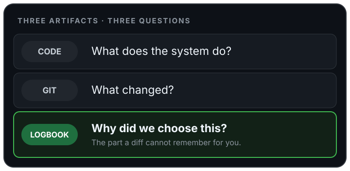
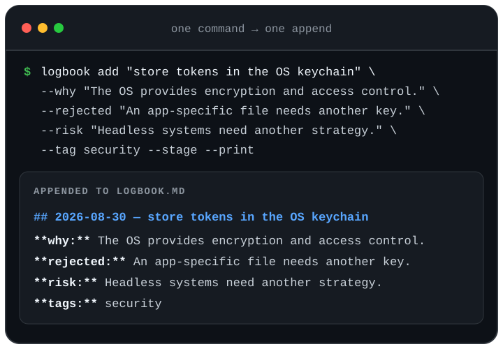
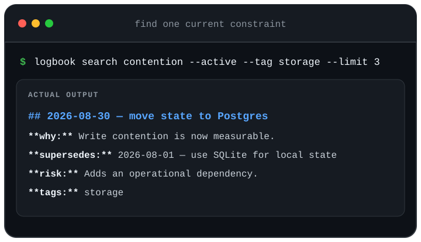
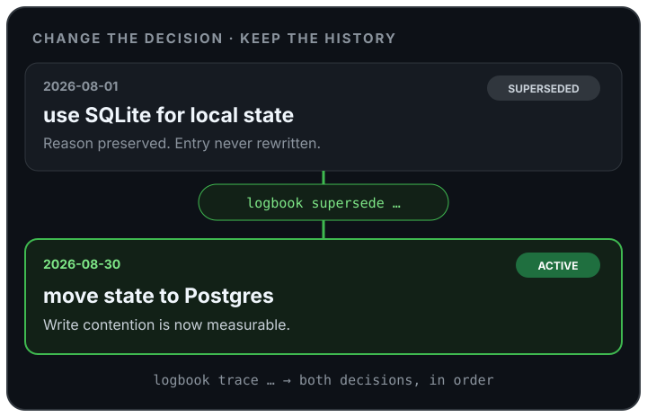
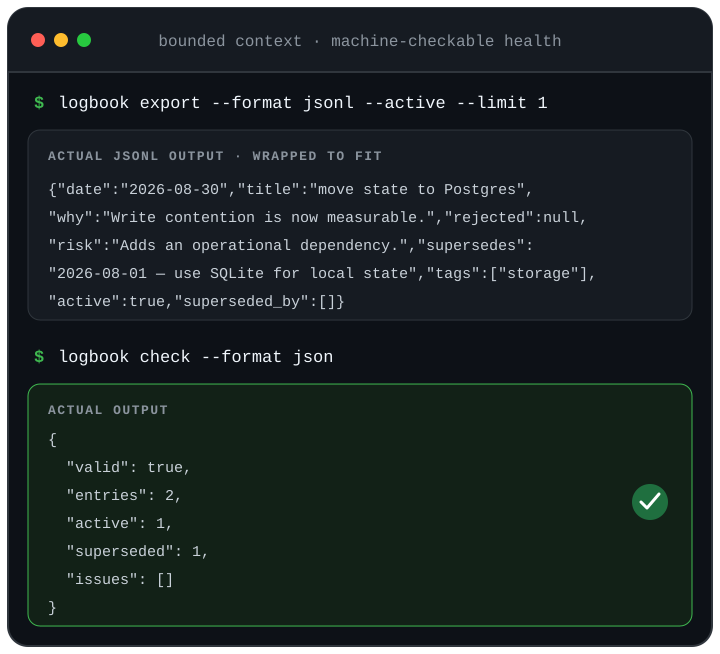

# logbook

[](https://crates.io/crates/logbook)
[](https://docs.rs/logbook)
[](https://github.com/jeffbai996/logbook/actions/workflows/ci.yml)

`logbook` is a tiny CLI for recording the decisions that shape a repository.

Code tells you what it does. Git tells you what changed. Logbook tells you why.



Each repository gets one append-only `logbook.md`: plain Markdown, reviewed and
versioned with the code it explains. There is no service, database, account, or
project scaffolding.

Write an entry when a choice is non-obvious, affects future work, and its reason
will not be clear from the diff. Skip routine changes, status updates, and
things the code already says better. Do not backfill a project diary: start
with the next decision future you would otherwise have to reverse-engineer.

## Install

With Rust 1.85 or newer:

```bash
cargo install logbook --locked
```

Prebuilt Linux, macOS, and Windows archives and `SHA256SUMS` are attached to the
[latest GitHub release](https://github.com/jeffbai996/logbook/releases/latest).

## 60-second workflow

Run this inside a Git repository:

```bash
logbook add "store tokens in the OS keychain" \
  --why "the OS provides encryption and access control" \
  --rejected "an app-specific file needs another key" \
  --risk "headless environments need a separate strategy" \
  --tag security \
  --stage --print

logbook last
logbook search keychain
```

That is the whole loop: record a decision, retrieve it later, and commit
`logbook.md` with the code it constrains. `add` creates the file when needed.
`--stage` runs `git add` for it; logbook never commits automatically. If
staging fails, the decision remains saved and the error prints the recovery
command.



The model diagrams explain how the file behaves. The retrieval panels below
reproduce real CLI output from fixed-date examples.

## The three jobs

### Record a decision

Pass the reason directly, pipe it on stdin with `--why -`, or omit `--why` to
write it in `$VISUAL` or `$EDITOR`:

```bash
logbook add "keep the API synchronous"

printf '%s\n' "A daemon adds lifecycle work without improving local writes." |
  logbook add "avoid a background worker" --why - --tag architecture
```

Only the title and reason are required. Add rejected alternatives, accepted
risks, and tags when they will help the next person understand the tradeoff.
Use `--date YYYY-MM-DD` only when importing a decision made earlier.

### Find the reason

The common retrieval commands are deliberately boring:

```bash
logbook list --active --limit 10
logbook search "write contention" --tag storage
logbook show 2026-08-01
logbook tags
logbook stats
```



`list`, `search`, and `export` share date, tag, active/superseded, and limit
filters. Repeated tags mean AND. `list` and `search` return the most recently
appended matches first; `show` keeps file order and `trace` keeps decision-chain
order. Stable JSON and JSON Lines stay in document order for scripts and agents:

```bash
logbook export --active --limit 10
logbook export --format jsonl --tag storage
```

From a nested directory, logbook finds the nearest `logbook.md` before the
repository root. `logbook where` shows the resolved path. Use `--file PATH` or
`LOGBOOK_FILE` only when the log lives somewhere unusual.

### Change your mind without deleting history

Do not edit an old decision into a new reality. Append its replacement:

```bash
logbook supersede 2026-08-01 "move state to Postgres" \
  --old-title "use SQLite for local state" \
  --why "write contention is now measurable" \
  --risk "adds an operational dependency" \
  --stage

logbook trace 2026-08-01 --title "use SQLite for local state"
```



The old entry stays intact and points forward through derived state; the new
entry points back with `supersedes`. A decision has one successor, so reverse
the current decision instead of branching an old one. `logbook check` catches
malformed entries and broken, ambiguous, duplicate, or branched links.

## Use with coding agents

Give an agent a small current slice, not the entire project diary:

```bash
logbook list --active --limit 10
logbook export --active --limit 10
logbook check --format json
```



Put this in the repository instructions if useful:

```markdown
Before product, architecture, or operational work, run
`logbook list --active --limit 10` and treat those decisions as constraints.
Record only new non-obvious decisions. Supersede reversals instead of rewriting
earlier entries.
```

There is no special agent integration. The CLI emits bounded JSON; the source
of truth remains a file any tool can read.

## Command reference

| Command | Purpose |
|---|---|
| `init [--stage]` | Create an empty logbook without overwriting one. |
| `add <title> [options]` | Append a decision from flags, stdin, or an editor. |
| `list [filters]` | Print matching decisions newest-first. |
| `search <term> [filters]` | Search all entry text case-insensitively. |
| `last` | Print the newest decision. |
| `show <date> [--title T]` | Print decisions on a date. |
| `supersede <date> <title> [options]` | Append a replacement decision. |
| `trace <date> [--title T] [--format human\|json]` | Print one complete decision chain. |
| `check [--format human\|json]` | Validate the file and supersession graph. |
| `export [--format json\|jsonl] [filters]` | Emit stable machine-readable records. |
| `tags` | List normalized tags and counts. |
| `stats` | Summarize decisions, dates, states, and tags. |
| `where` | Print the resolved logbook path. |
| `completions <shell>` | Generate a shell completion script. |

Run `logbook <command> --help` for every option.

## The file

The source of truth is ordinary Markdown:

```markdown
## 2026-08-01 — use SQLite for local state
**why:** it keeps installation to one binary and one data file
**rejected:** Postgres requires a service for a single-user tool
**risk:** write concurrency is limited
**tags:** storage

## 2026-08-20 — move state to Postgres
**why:** write contention is now measurable
**supersedes:** 2026-08-01 — use SQLite for local state
**risk:** adds an operational dependency
**tags:** storage
```

Hand edits remain possible. Writes use an adjacent atomic replacement and a
short-lived cross-process lock, so a crash cannot leave a partial entry and
concurrent writers do not lose one. In multiline fields passed by flag or
stdin, indent any literal line beginning with `## ` or a canonical field label
such as `**risk:**`; the CLI rejects an unindented structural line instead of
saving ambiguous Markdown. In the editor, lines whose first non-space character
is `#` are comments and are omitted.

Writes refuse a `logbook.md` symlink because atomic replacement would overwrite
the link itself; pass `--file` the target path instead. If a crashed process
leaves `<logbook path>.lock`, first verify no logbook writer is running, remove
that lock directory, and retry.

## The boundary

One repository. One file. Append-only. Local CLI. Git-native.

The 0.5 series is feature-complete and in maintenance mode. Bug fixes,
portability work, and dependency upkeep remain welcome; broader features do
not. Logbook will not grow a GUI, hosted service, database, sync layer, plugin
system, semantic search, daemon, telemetry, LLM integration, or automatic
decision extraction. Those belong in other tools.

## Development

```bash
cargo test --locked
cargo +1.85.0 test --locked
cargo fmt --all -- --check
cargo clippy --locked --all-targets -- -D warnings
cargo build --release --locked
cargo package --locked
```

CI covers Linux, macOS, Windows, and the Rust 1.85 MSRV. See
[CONTRIBUTING.md](CONTRIBUTING.md).

## License

[MIT](LICENSE)
